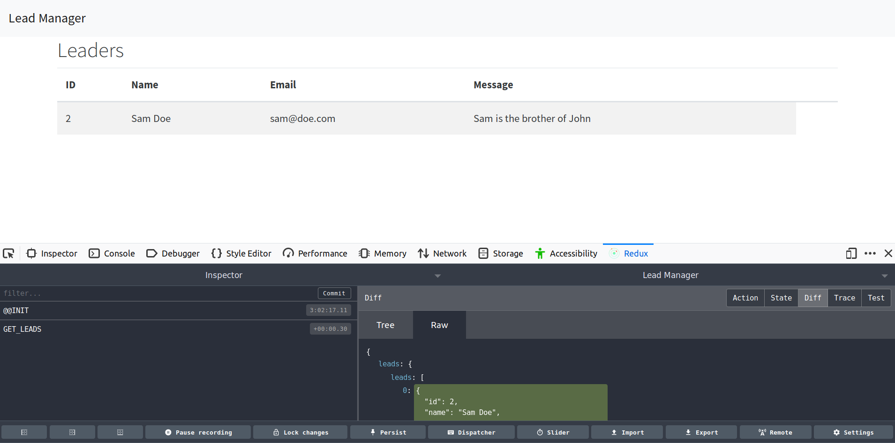

# README

This is a redo on [this
tutorial](https://www.youtube.com/playlist?list=PLillGF-RfqbbRA-CIUxlxkUpbq0IFkX60),
which I had previously worked on before all my work got lost by a
computer crash before committing (RIP).

ToDo --> add links to documentation when relevant

## Video 1: Basic REST API

Using [`pipenv`](https://docs.pipenv.org/en/latest/) instead of
`virtualenv` for this project for a change of pace. [Apparently it
combines a couple of
things](https://stackoverflow.com/questions/41573587/what-is-the-difference-between-venv-pyvenv-pyenv-virtualenv-virtualenvwrappe).

To use, we hit `pipenv shell` in the folder you care about and it will
automatically build pip files if it needs. You will need to install
files with `pipenv install <package>` install of `pip`. This will also
install the correct dependencies within your `Pipfile` at the root
directory.

We'll need to install a few dependencies

```shell
pipenv install django djangorestframework django-rest-knox
```

Then we'll generate a new django project: `django-admin startproject
leadmanager`, followed by a `leads` app with `python manage.py
startapp leads` and then add both to our settings file.

We'll create a model for a lead to use the ORM. These will be via
`leads` app. To put these models into use, we'll need to create and
run migrations with `python manage.py makemigrations leads` and
`python manage.py migrate` to add it to our database. This will
include default tables Django uses.

To utilize django rest framework, we need to create serializers. These
will be used to expose access to our models. To make our life easier,
we'll use `serializers.ModelSerializer`, which needs a `Meta`
subclass.

After the model is created, we'll add an `api.py`. This will allow for
actual access to our model via the serializer. This will utilize
ViewSets, which are sort of like CBVs under Django.

Then we'll add in our URLs. Unlike in normal django, we'll use the
router that is provided by django rest framework. 

Order of Operations: Model => serializer => api => urls

We'll use Postman to do APIs. We can POST a new entry and GET all (at
the base root or `/`) or get a specific post by specifiy ID (at
`/<id>`).

As this is fully compliant REST, we can delete entries -- be sure to
add the trailing slash!

This is a fully working API which is pretty neat. 


## Tutorial \#2

Here we'll start to implement React into our app. Because we're
integrating it directly into Django, we will add it as its own app and
will _not_ use any fancy scripts like `create-react-app` (phew).

First, we'll start our app called `frontend` which will hold all of
our react js work. After creating it, we'll need to add directories
for the app.

```shell
# tree view of `leadmanager/frontend`
.
├── admin.py
├── apps.py
├── __init__.py
├── migrations
│   └── __init__.py
├── models.py
├── src
│   └── components
├── static
│   └── frontend
├── templates
│   └── frontend
├── tests.py
└── views.py
```

From the root directory, above django, we'll initialize our npm
project with `npm init -y` and install `webpack` and `webpack-cli` in
addition to `@babel/core`, `babel-loader`, `@babel/preset-env`,
`@babel/peset-react`, and
`babel-plugin-transform-class-properties`. Then we'll do react
libraries (see below). 

```shell
# from my shell directly
$ npm i -D @babel/core babel-loader @babel/preset-env @babel/preset-react `babel-plugin-transform-class-properties`
$ npm i -D react react-dom prop-types     
```

All these dependencies will pop up in our `package.json` file.

To get using babel, we'll need a `.babelrc` file to hold all of our
babel transforms (lints?).Then we'll create our webpack config file to
hold all of our webpack info inside of `webpack.config.js`, which can
be separated out for different dev/qa/prod environments. Finally,
we'll make sure that `package.json` knows the entry point for react
inside of the `frontend` folder and output that to the `static` folder
within `frontend`. This will get the two environments separated as
well.

As is typical with React JS projects, we have an `index.js` at the
root directory that is our entrypoint into the project while
`components/App.js` really holds the bulk of our default homepage. As
for Django, an `index.html` will be needed. We'll also pull down
bootstrap info from bootswatch and associated libraries.

__Finally__, we need to add the index load function in our frontend
and a URL to access it via `urls.py`. This will necesitate having the
frontend urls being loaded as well. Also add frontend app to
`leadmanager/settings.py` file. 

Finally we can run everything!

### Layouts of Components

Our homepage will consist of two components (to start):

  - `Header` -- sits inside of `layouts`
  - `Dashboard` -- sits inside of `leads`

True to React style, `Dashboard` will be composed of two separate
components called `Leads` and `Form`, both within that folder. Doing
this will require using react's `Fragment` class, importable at the
top level from react. These will be very simple for now -- we'll fill
them out later. 


## Video \# 3

We'll implement redux here. This will allow us to have a golden source
of state to store all of our information.

We'll start by installing a few packages from NPM:

```shell
$ npm i -D redux react-redux redux-thunk redux-devtools-extension
```

Typically, one starts by creating their store file for redux, which
holds all of our state. For making debugging easier, we'll use
`redux-devtools-extensions` which makes the `store.js` file a bit more
unique.

`src/reducers` will then be created. An `index.js` file is added as a
root file. For now, this will be virtually blank.

Going back to `components/App.js`, we'll add the necesary code to
connect redux to our app.

If we pull up this app on our page, we can see that redux tools now
appears. This extension is pretty neat as it allows us to inspect
state while building the app!

Going back to our `reducers/index.js`, let's create the necesary
imports then the necesary files for those imports to work.

Reducers evaluate actions and then send down the necesary state. They
evaluate types to do this. It's best practice to keep these in a
separate folder and file called `actions`. 

Our reducers object will export a function that takes in the current
state and action. It then uses a switch function to evaluate which
action happened and, once found, passes that down to the correct
reducer for state change. State will change here typically here, and
is returned from that exported function.

We include whatever is already in the state with a spread operator
`...` and, if we specify conflicting keys, we can replace whatever was
in that state.

Once we have our reducer object done, we can go to action. It is here
that our components will call actions (vis-a-vis functions), modify
the state, and return the result.

For organizational purposes, the name for actions will be the same as
in reducers.

Now we'll create a mapping file called `leads.js` within actions that
does all the requesting. We'll add `axios` to our npm. The first
function we add will be an exported function `getLeads` and it will
return an object that gets modified.

Because we're using `thunk`, as the request is async, we'll pass
through `dispatch` as well. I presume the below notation passes
through dispatch before processing. 

```javascript
export const thing = () => dispatch => {
  axios.get(....)
};
```

In our action, we want to dispatch the result to our reducer. This
involves calling `dispatch` along with a `type` and `payload`. The
result is that `type` w/e gets called and the passed `payload` is
processed on our store.

Now we have our actions being propagated! We just need to connect this
up to our component itself.

Going back to `src/components/leads/Leads.js`, we'll add some imports
for redux. We'll also add `PropTypes` from library `prop-types`.

As a first step, we wrap our exported component with `connect`. To
access our state, we need to map it to a component property. This is
done with an arrow function called `mapStateToProps`. You can see this
inside of `components/leads/Leads.js`. This is where `propTypes` comes
in, as we can set those as well.

We can also pass in the `getLeads` action within our connect function
to properly hook that up as well. 

The end result -- looking only at the end of the file -- results in:

```javascript
const mapStateToProps = state => ({
    leads: state.leads.leads
});

export default connect(
  mapStateToProps,
  { getLeads } 
)(Leads);
```

You can see the state now reflected in redux tools. However, it's not
being called. To do that, we'll need to add it to
`componentDidMount()`, a lifecycle function within React
components. Here, we can directly call the function.

Then, we'll rewrite `render`. As we have a default state that is mapped
via `this.props` we can call `this.props.leads` as we mapped in
`mapStateToProps`. By using `Fragment` tags we can add further
components later or modify the existing one to include lists (I think
you need Fragment for this?). Note that each sub-jsx bit within our
rendered list will need a key, typically the id.

```javascript
{ this.props.leads.map(lead => (
                      <tr key={lead.id}>
                        <td>{lead.id}</td>
                        <td>{lead.name}</td>
                        <td>{lead.email}</td>
                        <td>{lead.message}</td>
                      </tr>
                  )) }
```

The end result looks like:



Neat! Now we'll add a delete lead action and have that modify the
corresponding lead. We'll create the action, then the type, then add
in the necesary code on the reducer.

Note that this action will delete the lead on our local
computer. Instead, it will send the necesary request to delete it on
the server. This marks an important difference: we need ot have our
reducer take care of that by running `filter`:

```javascript
// reducers/leads.js
    case DELETE_LEAD:
        return {
            ...state,
            leads: state.leads.filter(lead => lead.id !== action.payload)
        }
```

One interesting aspect here is that when creating the button, we use
`this.props.deleteLead.bind(this, lead.id)}`. Presumably this is to
ensure that our `deleteLead` function is taking in the id(?)

We'll also add these connected functions as prop-types. 

Now we'll add an `addLead` form. This will start with the component in
`components/leads/Forms.js`. First we give it an initial state, then
we pull out those sub pieces in the render function.

```javascript
// within our render(), we can pull out specific values this way
const { name, email, message } = this.state;
```

Our Form component will have two aspects: one for changes and one for
submissions.

The one for changes will simply change the values in question. This
looks wonky in React JS:

```javascript
onChange = e => this.setState({ [e.target.name]: e.target.value })
```

`onSubmit` will call our action to submit a new lead. First we create
the action, then the type, then the reducer -- as always.

Using spread operators, we can write very compact and readable
reducers as seen below:

```javascript
    case ADD_LEAD:
        return {
            ...state,
            leads: [...state.leads, action.payload]
        };
```

Because we are not using properties for state in our `Form` component,
we can pass in a null value when connecting the requisite
function. Don't forget to specify type for this function with
`PropTypes`.


## Video \# 4

Now we'll add alerts.

To do this, we need to add the appropriate library for react js. We'll
install `react-alert`, `react-alert-template-basic`, 
`react-transition-group`. This allows us to pull in a function and
wrap our components with it, giving them the ability to call alerts.

Now we'll add our alert provider within the `App.js` file. This will
be an app component that wraps everything (though we still want to
keep our storage provider as the outer most). We'll need to specify
options and a template. The former we'll create as `alertOptions` and
the latter will be pulled from `react-alert-template-basic`.

Next, we'll create a component for alerts. This will be a simple class
based component that returns almost nothing (just a fragment) but
calls an alert at load and is exported with `withAlert(...)`. We'll
add if-else statements later on to get this well.

Then we'll need to create reducers that call this component when
necesary. 

The reducer will be simple, stored in `reducers/errors.js`. For now,
just a `GET_ERRORS`. Unlike the other actions, we'll simply dispatch
from the leads actions. They will call the requisite reducer action,
which will trigger an alert.

Let's go back to `components/layout/Alerts.js`. Like before, let's
connect the state to our component. Instead of using
`componentDidMount`, which gets called once at instantiation of the
component, let's use `componentDidUpdate`. Because of the life cycles
of using React JS, this function will be better as it's called
multiple times.

`componentDidUpdate` takes a variable called `prevProps`. We'll use
this to check against the current state. If they've differed, then we
have problems. 

Note to self: `react-alert` had some major change from 4.x to 5.x. The
video uses the former while a blind install from npm will install the
former. The former will give weird esoteric errors I have not been
able to track down so keep that in mind.

__I stopped at this point, he also installs a messages error handling
which looked like overkill__

_PPS: I still don't get where the hell state.message and state.errors
comes from given we never add it like that_


## Video \# 5

Now we'll do token authenticaton (woo!)

This will start by going back to the backend in Django. We'll go to
our `leads/model.py` and bring in the User model, default from
Django. Then we'll link the our `Lead` model with our `User` model
using `owner=models.ForeignKey(User, ...)`.

After adding a `models.ForeignKey`, we'll run `makemigrations` and
`migrate`. 

Inside of `leads/api.py`, we can change this up to accomodate our new
permission class. First, we need to change `queryset` which, because
we only want to grab those owned by the user, we'll use a function.

```python
    def get_queryset(self):
        return self.request.user.leads.all();
```

Lastly, we need to swap out the `perform_create` function from its
default. This new function we define will take in a `serializer`
parameter and call `serializer.save(owner=self.request.user)` so that
the corresponding owner of that lead will get saved.

There are a couple of things to do inside of `settings.py`. First, a
new value will be added for `REST_FRAMEWORK` so that it knows we want
to use Knox authentication. Next, we need to add in `knox` to our
installed apps. 

```python
REST_FRAMEWORK = {
    'DEFAULT_AUTHENTICATION_CLASSES': ('knox.auth.TokenAuthencation',)
}
```

Following all this, we'll run a migration so knox can update itself.

Now we'll create an accounts app. This will be used for logging and
registering new users via the REST API.

Each action will get it's own serializer. Remember that we create
serializers followed by api (in this case no models needed).

For the `RegisterSerializer`, we'll override the `create` function and
add in some extra code to deal with validating the creation of a new
user. Know that User objects have their passwords salted, so this is
part of that process.

Then we need apis. These are in `accounts/api.py`, which will use
generics where each function computes the name of the request
(ex. `post()` handles POST requests). There is a slight change here in
that `AuthToken.objects.create(user)` needs to be called manually. 

Lastly, we'll add in `urls.py` and punch in the appropriate bits,
adding into our master urls at `leadmanager/urls.py`.

Note that when testing this you'll want to add the `Authorization`
header with `Token <insert-token>` from the login, _no quotes_. 

For our log out URL, we'll borrow from Knox via
`knox_views.LogoutView.as_view()`. This will cause the token to be
invalidated.


